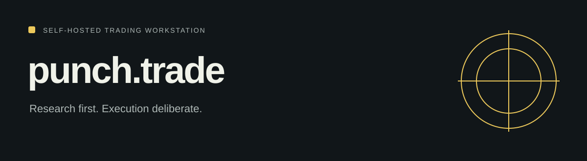

# punch.trade

<!-- repo-badges:start -->
<div align="center">

[](https://github.com/honeyamn10-source/punch.trade/stargazers)
[](https://github.com/honeyamn10-source/punch.trade/forks)
[](https://github.com/honeyamn10-source/punch.trade/issues)
[](https://github.com/honeyamn10-source/punch.trade/commits/master)
[](https://github.com/honeyamn10-source/punch.trade/blob/master/LICENSE)

[Repository](https://github.com/honeyamn10-source/punch.trade) · [Issues](https://github.com/honeyamn10-source/punch.trade/issues) · [Pull Requests](https://github.com/honeyamn10-source/punch.trade/pulls) · [Actions](https://github.com/honeyamn10-source/punch.trade/actions)

</div>
<!-- repo-badges:end -->

<!-- professional-meta:start -->
<div align="center">

[](https://github.com/honeyamn10-source/punch.trade/actions/workflows/ci.yml) [](https://github.com/honeyamn10-source/punch.trade/actions/workflows/codeql.yml)

  

[Documentation](docs) · [Contributing](CONTRIBUTING.md) · [Security](SECURITY.md) · [Changelog](CHANGELOG.md)

</div>
<!-- professional-meta:end -->


A FastAPI workstation with strategy research, backtesting, risk controls, a local dashboard and a Chrome extension.

[Project website](https://honeyamn10-source.github.io/punch.trade/) · [Build results](https://github.com/honeyamn10-source/punch.trade/actions)

## What it does

- **Inspect strategies.** Explore strategy modules, research tools and backtests.
- **Review risk.** Risk and execution layers sit between a signal and an order.
- **Start in paper mode.** The default feed is synthetic and execution is paper unless explicitly configured.

## Start from source

Python and the dependencies in backend/requirements.txt. Review .env.example and the deployment guide.

```bash
git clone https://github.com/honeyamn10-source/punch.trade.git
cd punch.trade
python -m pip install -r backend/requirements.txt
cd backend
python run.py
```

## Verify

```bash
cd backend
python -m pytest tests -q
```

## Scope

Development workstation. Broker adapters require independent verification. Backtests do not establish future returns; synthetic feed and paper execution are the defaults.

## Find your way around

- [Architecture](docs/ARCHITECTURE.md)
- [Deployment](docs/DEPLOYMENT.md)
- [Test guide](docs/TESTING.md)

## Contributing and license

See [CONTRIBUTING.md](CONTRIBUTING.md). Include a minimal reproduction and runtime versions with bug reports; remove credentials from logs.

MIT — see [LICENSE](LICENSE). Third-party dependencies retain their applicable licenses.
